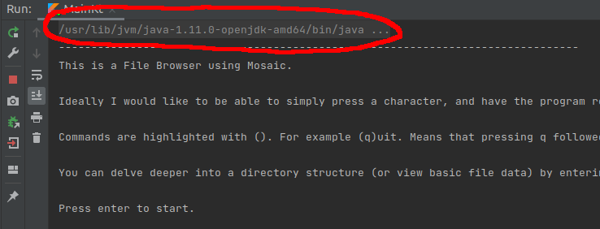

# Mosaic File Browser

A basic File Browser implemented using Compose related Mosaic Library

What is Compose: https://developer.android.com/jetpack/androidx/releases/compose-ui

What is Mosaic: https://github.com/JakeWharton/mosaic

What is Jetpack Compose (not related to this project specifically): https://developer.android.com/jetpack/compose

# Running the code

I have been running the code firstly through Intellij Idea, this provides a complete command to run in an external
terminal. The code run inside Intellij will not work with Mosaic correctly. Intellij strips the codes required to edit
the text.

The Intellij output will contain something like this:

```
/usr/lib/jvm/java-1.11.0-openjdk-amd64/bin/java -javaagent:/home/david/idea-IC-211.7442.40/lib/idea_rt.jar=35779:/home/david/idea-IC-211.7442.40/bin -Dfile.encoding=UTF-8 -classpath /home/david/repo/MosaicFileBrowser/build/classes/kotlin/main:/home/david/.gradle/caches/modules-2/files-2.1/com.jakewharton.mosaic/mosaic-runtime/0.1.0/c80c74467ab2c136e61890412d3e09c0a9ce6180/mosaic-runtime-0.1.0.jar:/home/david/.gradle/caches/modules-2/files-2.1/org.jetbrains.kotlin/kotlin-stdlib-jdk8/1.5.10/3f4af7aff21c4ec46e3cdd645639d0a63a68d3d0/kotlin-stdlib-jdk8-1.5.10.jar:/home/david/.gradle/caches/modules-2/files-2.1/com.jakewharton.mosaic/compose-runtime/0.1.0/7c9e8c27b7eb450932b17371ea604a566ac13602/compose-runtime-0.1.0.jar:/home/david/.gradle/caches/modules-2/files-2.1/org.jetbrains.kotlinx/kotlinx-coroutines-core-jvm/1.5.0/d8cebccdcddd029022aa8646a5a953ff88b13ac8/kotlinx-coroutines-core-jvm-1.5.0.jar:/home/david/.gradle/caches/modules-2/files-2.1/org.jetbrains.kotlin/kotlin-stdlib-jdk7/1.5.10/c49d0703d16c6cb1526cc07b9b46486da1dd8a60/kotlin-stdlib-jdk7-1.5.10.jar:/home/david/.gradle/caches/modules-2/files-2.1/org.jetbrains.kotlin/kotlin-stdlib/1.5.10/da6a904b132f0402fa4d79169a3c1770598d4702/kotlin-stdlib-1.5.10.jar:/home/david/.gradle/caches/modules-2/files-2.1/org.jetbrains.kotlin/kotlin-stdlib-common/1.5.10/6b84d926e28493be69daf673e40076f89492ef7/kotlin-stdlib-common-1.5.10.jar:/home/david/.gradle/caches/modules-2/files-2.1/org.jetbrains/annotations/13.0/919f0dfe192fb4e063e7dacadee7f8bb9a2672a9/annotations-13.0.jar:/home/david/.gradle/caches/modules-2/files-2.1/org.fusesource.jansi/jansi/2.0.1/f06c9a5de671d4709f2e26c83b0363653ae77c9e/jansi-2.0.1.jar dae.mosaicfilebrowser.MainKt
```



You can copy that from your IDE into an external terminal. There it should work correctly.

# Known bugs

~~The system will currently shift position down a line when you press enter. I assume this is due to Mosaic attempting
to re-write a line, but the line is no longer at the same position.~~

There is an issue where differing heights of output result in pushing the content around. Making the output from another
command show up. This is mitigated by forcing the screens to be the same height. The splash screen is larger than the
other screens. So the issue is visible when switching from the splash to the directory list.